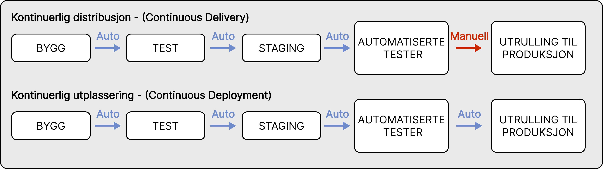

Når vi har bygget, testet og godkjent koden vår, er det på tide å utplassere den til produksjon. Automatisering av utrulling til produksjon kan bidra til å redusere risikoen for feil og sikre at koden blir utplassert jevnlig og pålitelig. Etter at koden er utplassert til produksjon, er det viktig å overvåke ytelsen og tilstanden til applikasjonen. Dette kan bidra til å oppdage eventuelle problemer tidlig og sikre at applikasjonen fungerer som forventet. Alt av feil og problemer bør loggføres og håndteres raskt for å sikre en god brukeropplevelse.

## To former for automatisert utrulling

##### **Kontinuerlig distribusjon (Continuous Delivery)**:

- **Ekstra sikkerhet**: Manuell godkjenning gir menneskelig innsyn før utrulling, noe som kan forhindre uønskede endringer i produksjon.
- **Samsvar med regler**: Egnet for regulerte industrier som krever manuell gjennomgang og dokumentasjon.

##### **Kontinuerlig utplassering (Continuous Deployment)**:

- **Fullstendig automatisering**: Hver endring som passerer de automatiserte testene, blir automatisk rullet ut til produksjon.
- **Rask tid til markedet**: Endringer blir raskt tilgjengelig for sluttbrukere.

import SelectCorrect from "../../../../components/SelectCorrect.astro";

<SelectCorrect
  question="Hva er formålet med å automatisere utrulling til produksjon?"
  correct="For å sikre at koden blir raskt og sikkert utplassert til produksjon."
  wrong1="For å teste koden i et realistisk miljø før den rulles ut til produksjon."
  wrong2="For å overvåke ytelsen og tilstanden til applikasjonen."
/>

import LikeThisPage from "../../../../components/LikeThisPage.astro";

<LikeThisPage />
