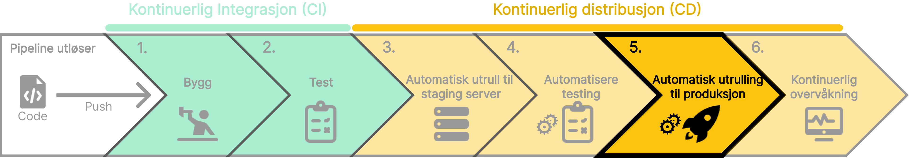

Når vi har bygget, testet og godkjent koden vår, er det på tide å utplassere den til produksjon. Automatisering av utrulling til produksjon kan bidra til å redusere risikoen for feil og sikre at koden blir utplassert jevnlig og pålitelig. Etter at koden er utplassert til produksjon, er det viktig å overvåke ytelsen og tilstanden til applikasjonen. Dette kan bidra til å oppdage eventuelle problemer tidlig og sikre at applikasjonen fungerer som forventet. Alt av feil og problemer bør loggføres og håndteres raskt for å sikre en god brukeropplevelse.

### To former for automatisert utrulling

Det er to hovedformer for automatisert utrulling til produksjon som tilbyr forskjellige nivåer av automatisering og kontroll:
Continuous Delivery innebærer at koden alltid er klar for utrulling etter at den har passert automatiserte tester. Selve utrullingen til produksjon krever en manuell godkjenning.
Scenario:
Situasjoner hvor hver utrulling skal gjennomgå manuelt for ekstra sikkerhet.
Regulerte industrier som krever manuell gjennomgang for samsvar med regler og forskrifter.

Continuous Deployment tar automatisering et skritt videre ved å automatisere hele utrullingsprosessen til produksjon uten behov for manuelle inngrep, så lenge alle automatiserte tester er vellykket.
Fordeler:
Fullstendig automatisering: Hver endring som passerer de automatiserte testene, blir automatisk rullet ut til produksjon.
Rask tid til markedet: Endringer blir raskt tilgjengelig for sluttbrukere.
Scenario:
Hurtigutviklingsmiljøer hvor endring og forbedringer må rulles ut raskt. Situasjoner hvor det er avgjørende å få nye funksjoner og feilrettinger raskt ut til brukerne.

import SelectCorrect from "../../../../components/SelectCorrect.astro";

<SelectCorrect
  question="Hva er formålet med å automatisere utrulling til produksjon?"
  correct="For å sikre at koden blir raskt og sikkert utplassert til produksjon."
  wrong1="For å teste koden i et realistisk miljø før den rulles ut til produksjon."
  wrong2="For å overvåke ytelsen og tilstanden til applikasjonen."
/>

import LikeThisPage from "../../../../components/LikeThisPage.astro";

<LikeThisPage />
