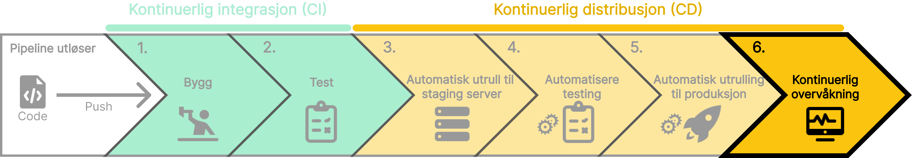

Etter at koden er utplassert til produksjon, er det viktig å kontinuerlig overvåke ytelsen og tilstanden til applikasjonen. Kontinuerlig overvåkning spiller en kritisk rolle i å sikre at applikasjonen fungerer som forventet, og bidrar til å oppdage og løse problemer.
Med kontinuerlig overvåkning kan teamet proaktivt håndtere problemer, optimere ytelsen og sikre en smidig drift av applikasjonen i produksjonsmiljøet.

import SelectCorrect from "../../../../components/SelectCorrect.astro";

<SelectCorrect
    question="Hva er formålet med kontinuerlig overvåkning av applikasjonen?"
    correct="For å sikre at applikasjonen fungerer som forventet og oppdage og løse problemer."
    wrong1="For å teste koden i et realistisk miljø før den rulles ut til produksjon."
    wrong2="For å overvåke ytelsen og tilstanden til applikasjonen."

/>

import LikeThisPage from "../../../../components/LikeThisPage.astro";

<LikeThisPage />
