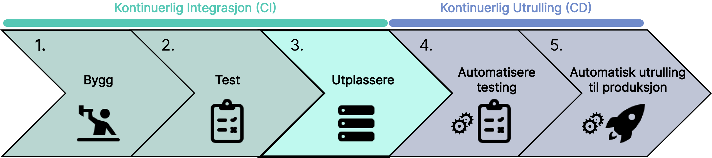

Når koden er bygget og testet, er det neste steget å utplassere den til en staging server. En vellykket utplassering til staging serveren gjør at vi kan teste koden i et miljø som er svært likt produksjonsmiljøet. Dette sikrer at alt fungerer som forventet før det når sluttbrukeren.

## Scenario

Det finnes mange verktøy som kan hjelpe deg med å utplassere koden din på en staging server. To populære verktøy er Docker og Jenkins. Å kombinere disse verktøyene gir følgende fordeler.

- **Automatisert utplassering**: Raskere og mer effektiv testing
- **Rollback-muligheter**: En enkel og rask tilbakekalling av endringer hvis det oppstår problemer.
- **Pålitelighet**: Sikrer konsistent drift i et stagingmiljø før produksjon.

import SelectCorrect from "../../../../components/SelectCorrect.astro";

<SelectCorrect
  question="Hva er formålet med å utplassere koden på en staging server?"
  correct="For å teste koden i et realistisk miljø før den rulles ut til produksjon."
  wrong1="For å rulle ut koden til produksjon."
  wrong2="For å lagre koden på en midlertidig server."
/>

import LikeThisPage from "../../../../components/LikeThisPage.astro";

<LikeThisPage />
