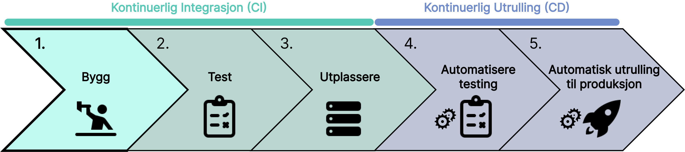

Når kodenendringen blir pushet til Github (versjonskontrollsystem), utløses CI/CD pipelinen automatisk. Pipelinen starter med byggfasen. I denne fasen bygges prosjektet fra kildekode til et kjørbart format. Dette inkluderer følgende trinn:

1. **_Kompilering av Kode_**: Koden oversettes fra kildekode (som Java, C++, Python) til maskinlesbar kode.
2. **_Innsamling av Avhengigheter_**
   Biblioteker og andre nødvendigheter lastes ned og inkluderes i byggeprosessen.
3. **_Pakking_**: Den kompilerte koden og avhengighetene pakkes sammen til et distribuert format. (F.eks et docker-image).

## Scenario: Jenkins og Docker

Jenkins er et verktøy som automatiserer hele CI/CD prosessen. Verktøyet integreres med versjonskontrollsystemet for å bygge, teste og utplassere koden automatisk hver gang endringer pushes. Jenkins har et bredt spekter av plugins for å tilpasse pipelinene til utviklerens behov.

Docker er et verktøy som dekker trinn 3 i byggfasen. Fordelen ved å bruke docker er at applikasjonen fungerer konsistent på tvers av forskjellige miljøer. Docker tilføyer også sikkerhet, ettersom koden blir pakket inn i en container. Denne containeren

Ved å bruke både Docker og Jenkins kan utvikleren:
Bygge applikasjonen i Jenkins
Pakke den i en Docker-container
Automatisere testing og utplassering med Jenkins.
Dette gir utvikleren en effektiv, konsistent og automatisert utviklings- og utrullingsprosess.

import SelectCorrect from "../../../../components/SelectCorrect.astro";

<SelectCorrect
  question="Hvorfor bygger vi koden vår før vi tester den?"
  correct="For å kompilere og pakke koden slik at den kan kjøres på en maskin."
  wrong1="For å teste at koden fungerer som forventet."
  wrong2="For å finne syntaksfeil i koden."
/>

import LikeThisPage from "../../../../components/LikeThisPage.astro";

<LikeThisPage />
