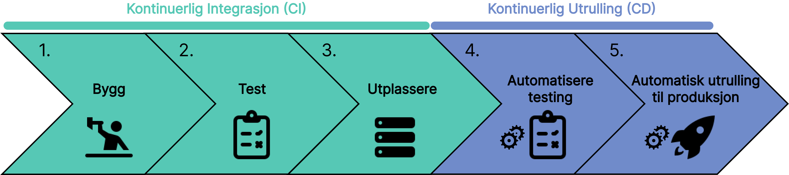

import Experience from "../../../components/Experience.astro";
import LikeThisPage from "../../../components/LikeThisPage.astro";

En CI/CD-pipeline er en serie automatiserte trinn som forbedrer hvordan små endringer integreres i større prosjekter. Dette sikrer at endringene kan pushes og testes uten å krasje andre deler av applikasjonen. Her er de forskjellige fasene:

Scenario: Du har nettopp blitt ansatt hos en bedrift og skal bidra med å videreutvikle en applikasjon. Bedriften har teams bestående av utviklere som jobber med forskjellige deler ved applikasjonen. I løpet av en dag vil mange små endringer forekomme. Hvordan kan vi klare å gjennomføre mange små endringer ved en applikasjon på tvers av ulike teams problemfritt og effektivt? Hvordan kan du sørge for at dine forandringer ikke påvirker og evt crasher andre deler av applikasjonen?

<LikeThisPage />
